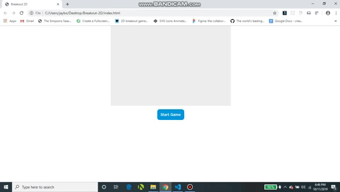

# Breakout-2D

This is the game breakout in 2D created using JavaScript and HTML canvas. Use the ball and paddle to break the bricks! Each brick you break gives you 1 point towards your overall score. Break all the bricks to win the game! The game keeps track of player lives and the current score. There is a message for when you win the game or if you lose.

[View the live demo](https://breakout-2d-jp.herokuapp.com/index.html)

If you'd like to view my portfolio, [Click here](https://jasonpallone.com)

To run this project on your PC follow the steps below.

1. Clone this repo to your PC using git clone.
2. Go to this projects directory location on your PC.
3. Open the directory, right click the HTML file and select "Open with"
4. Then select your preferred broswer.
5. The game should now be up and running on your PC in your preferred browser window.

Thanks for checking out my project!
